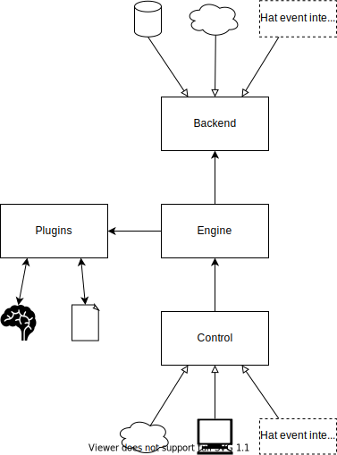

Server
======

AIMM server is a server application that listens on one or several interfaces
(web services, multiprocess communication, etc.) and allows the clients that
connect to them to perform various operations with its configured plugins.

Usage
-----

After successful installation, the server can be run by calling
``aimm-server`` in the command line. The command has the following interface:

    .. program-output:: python -m aimm.server.main --help

Configuration
-------------

To use the server, it needs to be configured. The configuration is a YAML file
that contains options specific to different components of which the system
consists. It also contains options for logging and Hat configuration. It needs
to validate against the following schema:

.. literalinclude:: ../../schemas_json/server/main.yaml
   :language: yaml

Logging configuration is mandatory and its values are passed directly to the
:func:`logging.basicConfig` function. Remaining properties of the root part
of the configuration directly correlate to the main components of the server's
architecture, are more complex and will be explained separately.

Hat
---

AIMM server configuration contains options that allow it to work as a part of
`Hat`_ infrastructure. The optional ``hat`` property of the configuration
contains the options that allow this integration.

.. _hat: https://hat-open.com/

Connection to monitor is the minimal requirement in order to integrate to the
Hat network and the configuration parameters are as specified by the `monitor
client documentation`_. Additionally, if ``event_server_group`` field is set,
AIMM server will also attempt to connect to event server with in the given
group. If these properties are configured but the server cannot connect to
Hat components, it will halt and wait until it manages to connect.

.. _monitor client documentation: https://hat-monitor.hat-open.com/py_api/hat/monitor/client.html

Since AIMM server supports dynamic imports of different backend and control
implementations that may use the event server connection to receive and
register events, the modules containing these components need to implement a
``get_subscriptions`` function that returns a list of event server
subscriptions. It should have the following type:

.. autodata:: aimm.server.common.CreateSubscription

A combined list of all these subscriptions is then used as the global
subscription of the entire server. If the ``get_subscriptions`` function is
provided, the component implementation will receive an instance of a
:class:`aimm.server.common.ProxyClient`, which is an object with an interface
similar to the regular `Hat event client`_, but is actually notified of the new
events by the real event client when events it subscribes to are received. It
has the following signature:

.. _Hat event client: https://hat-event.hat-open.com/py_api/hat/event/client.html#hat.event.client.Client

.. autoclass:: aimm.server.common.ProxyClient
    :members:

Architecture
------------

After initialization and, optionally, Hat integration, the architecture of AIMM
server may be represented with the following diagram:

The main components are:

  * engine - implements function calls that connect control interfaces with
    plugins, keeps the state of the application and uses backend to store it
    when neccessary
  * backend - handles state data persistence
  * plugins - contain model and data access implementations
  * control - provides external interfaces for clients, calls engine functions
    and notifies clients of state changes or call results

Common data structures
----------------------

The server has some common data structures used in different components,
required as arguments at some methods or returned as their results. They are
documented in this section. 

.. autoclass:: aimm.server.common.Model
    :members:
.. autoclass:: aimm.server.common.DataAccess
    :members:

Components
----------

.. toctree::
    :maxdepth: 1

    engine
    backend
    control/index
