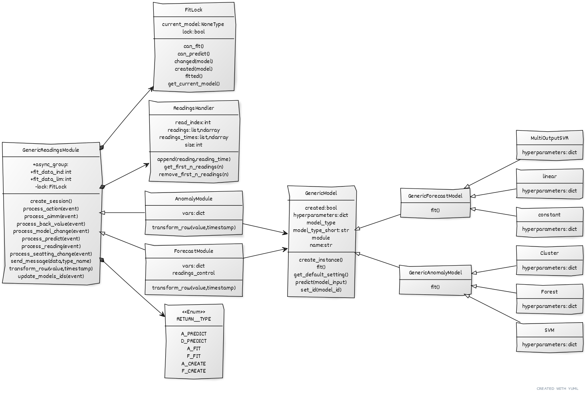

# hat-aimm-anomaly
Hat aimm anomaly example.


### DataFlow

[```AnomalyModule```](src_py/air_supervision/modules/anomaly/anomaly.py)  and [```ForecastModule```](src_py/air_supervision/modules/forecast/forecast.py) run in parallel. Both are inherited from [```GenericReadingsModule```](src_py/air_supervision/modules/controller_generic.py).

Both recieve new data from the device with event types: ```('gui', 'system', 'timeseries', 'reading')```.
The received data is being saved in their ```ReadingsHandler```'s (objects that handle when that data should be propagated to the adapter).

When the event from adapter with a type ```('back_action', 'forecast', '*')``` or ```('back_action', 'anomaly', '*')``` is read, that module will
run appopriate function to deal with that action.

Types of actions you can expect from the adapter:

* ```setting_change```
* ```model_change```

In case of a event with type = ```('back_action', '*', 'model_change')```, ```ForecastModule```/```AnomalyModule``` create a new model instance of a class with the name ```'model'``` in that event dict. (for example ```event.payload.data['model']``` is in that case == ```'SVM'``` and class 'SVM' exists in anomaly_model.py).

Each ForecastModule/AnomalyModule have their own dicts of model objects and depending on later back_action events,that dicts gets appended with new models. If a model of same type is again registered, that wont create a new model, it will just label old one 
as the current. (only one can be the current model in both modules)

For example ```ForecastModule``` has the following models generated: (so when action create/fit/predict is called, it will be called upon current model)
```py
MODELS = {
    'MultiOutputSVR': *MultiOutputSVR OBJECT*,
    'linear': *linear OBJECT*
}
current_model = 'linear'
```


[```FitLock```](src_py/air_supervision/modules/controller_generic.py) class is used to manage which model is the current one,and in which state it is(is it fitted or not or is it even defined, that way we cant send predict actions beforehand).

When a model is created, module sends a message to AIMM module to create that model with a same name in backend. When we get confim message, we fit that model and prepare data for prediction process.

When [```ReadingsHandler```](src_py/air_supervision/modules/controller_generic.py) is ready and current model is defined and is fitted (we also get a confirm message from AIMM), we send a batch of data to AIMM for prediction.
AIMM will return predicted values,that we then send to the adapter.


If we get a setting_change event,it is expected from the module to update hyperparameters of the current model. (means that a user changes some of that and wants the model to be re-fitted). In that case, we re-fit the current model with new parameters.


### UML

Done in https://yuml.me/

```
[GenericReadingsModule]++->[FitLock]
[GenericReadingsModule]++->[ReadingsHandler]

[GenericReadingsModule]^[AnomalyModule]
[GenericReadingsModule]^[ForecastModule]


// Add notes
//[Order]-[note: Aggregate Root ala DDD]

// Add more detail
[GenericReadingsModule|+async_group: ;+fit_data_ind: int;+fit_data_lim: int;-lock: FitLock|create_session();process_action(event);process_aimm(event);process_back_value(event);process_model_change(event);process_predict(event);process_reading(event);process_seatting_change(event);send_message(data,type_name);transform_row(value,timestamp);update_models_ids(event);]

[FitLock|current_model: NoneType ;lock: bool|can_fit();can_predict();changed(model);created(model);fitted();get_current_model();]

[AnomalyModule|vars: dict|transform_row(value,timestamp);]

[ForecastModule|vars: dict;readings_control|transform_row(value,timestamp);]

[ReadingsHandler|read_index: int ;readings: list,ndarray;readings_times: list,ndarray;size: int|append(reading,reading_time);get_first_n_readings(n);remove_first_n_readings(n);]

[GenericModel|created: bool;hyperparameters: dict;model_type;model_type_short: str;module;name:str; |create_instance();fit();get_default_setting();predict(model_input);set_id(model_id);]

[GenericModel]^[GenericForecastModel||fit();]
[GenericModel]^[GenericAnomalyModel||fit();]

[GenericForecastModel]^[MultiOutputSVR|hyperparameters: dict]
[GenericForecastModel]^[linear|hyperparameters: dict]
[GenericForecastModel]^[constant|hyperparameters: dict]

[GenericAnomalyModel]^[Cluster|hyperparameters: dict]
[GenericAnomalyModel]^[Forest|hyperparameters: dict]
[GenericAnomalyModel]^[SVM|hyperparameters: dict]

[GenericReadingsModule]++->[≪Enum≫;RETURN__TYPE||A_PREDICT;D_PREDICT;A_FIT;F_FIT;A_CREATE;F_CREATE;]

[AnomalyModule]->[GenericModel]
[ForecastModule]->[GenericModel]
```