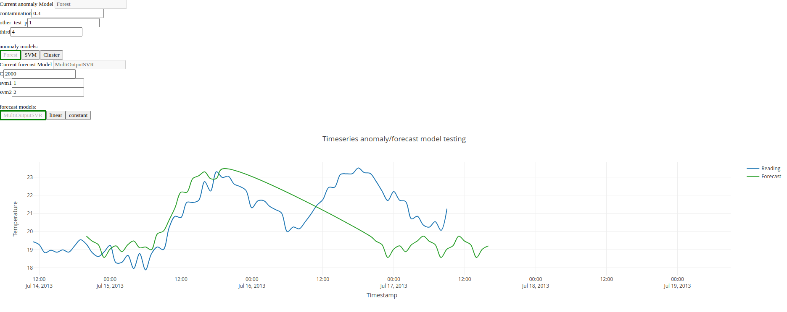

# hat-aimm-anomaly
Hat aimm anomaly example.



## Use

To run the example on your machine, install all of the pip dependencies and run
`install.sh`. There is also a Dockerfile available, that can be used to generate a
docker image and use it to run the example. The example uses ports 23020 to 23023, where
the main GUI app is on 23023.


## Implementation


### DataFlow

[```AnomalyModule```](src_py/air_supervision/modules/controller/anomaly.py) and
[```ForecastModule```](src_py/air_supervision/modules/controller/forecast.py)
run in parallel. Both are inherited from
[```GenericReadingsModule```](src_py/air_supervision/modules/controller/common.py).

Both recieve new data from the device with event types: ```('gui', 'system',
'timeseries', 'reading')```. The received data is being saved in their
```ReadingsHandler```'s (objects that handle when that data should be
propagated to the adapter).

When the event from adapter with a type ```('back_action', 'forecast', '*')```
or ```('back_action', 'anomaly', '*')``` is read, that module will run
appopriate function to deal with that action.

Types of actions you can expect from the adapter:

* ```setting_change```
* ```model_change```

In case of an event with type = ```('back_action', '*', 'model_change')```,
```ForecastModule```/```AnomalyModule``` create a new model instance of a class
with the name ```'model'``` in that event dict. (for example
```event.payload.data['model']``` is in that case == ```'SVM'``` and class
'SVM' exists in anomaly_model.py).

Each ForecastModule/AnomalyModule have their own dicts of model objects and
depending on later back_action events,that dicts gets appended with new models.
If a model of same type is again registered, that wont create a new model, it
will just label old one as the current. (only one can be the current model in
both modules)

For example ```ForecastModule``` has the following models generated: (so when
action create/fit/predict is called, it will be called upon current model)
```py
models = {
    'MultiOutputSVR': *MultiOutputSVR OBJECT*,
    'linear': *linear OBJECT*
}
current_model = 'linear'
```


[```FitLock```](src_py/air_supervision/modules/controller/common.py) class is
used to manage which model is the current one,and in which state it is(is it
fitted or not or is it even defined, that way we cant send predict actions
beforehand).

When a model is created, module sends a message to AIMM module to create that
model with a same name in backend. When we get confim message, we fit that
model and prepare data for prediction process.

When
[```ReadingsHandler```](src_py/air_supervision/modules/controller/common.py)
is ready and current model is defined and is fitted (we also get a confirm
message from AIMM), we send a batch of data to AIMM for prediction.  AIMM will
return predicted values,that we then send to the adapter.


If we get a setting_change event,it is expected from the module to update
hyperparameters of the current model. (means that a user changes some of that
and wants the model to be re-fitted). In that case, we re-fit the current model
with new parameters.
